# Mini To‑Do App

To‑Do App est une petite application qui permet de gérer une liste de tâches.

Elle fonctionne en deux parties :

- Un backend (une API qui permet d’ajouter des tâches et de les afficher.)
- Un frontend (Une petite interface web qui affichera les tâches et permettra d’en ajouter.)

## technologies choisies

### backend :

- Nodes.js
- Express.js

### frontend :

- HTML/CSS
- Javascript

## Test du backend en local

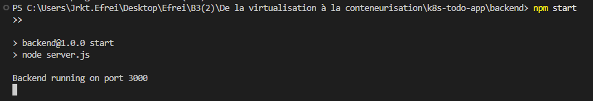

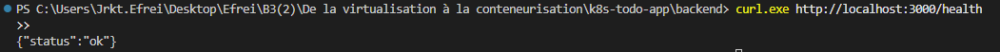

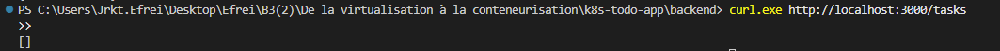

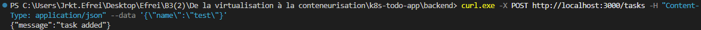

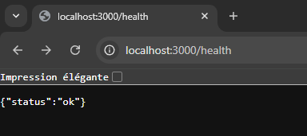

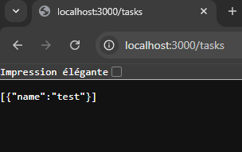

## Test du backend dans Docker

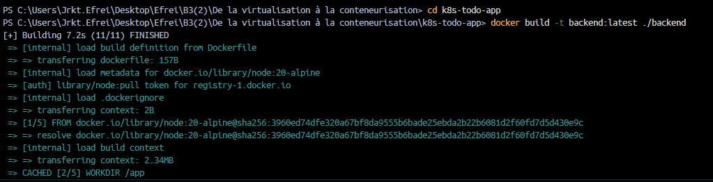

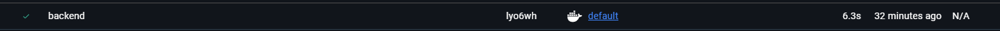

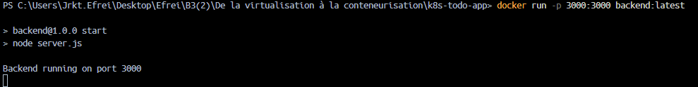

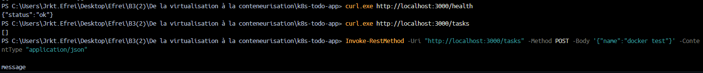

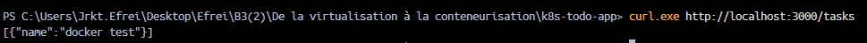

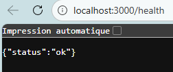

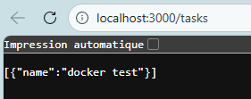

## Dockerisation du frontend/backend + affichage du projet

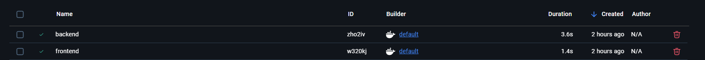

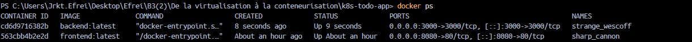

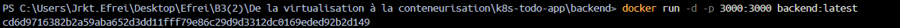

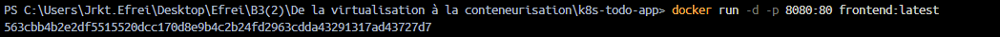

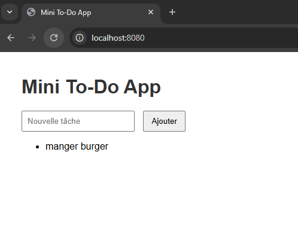

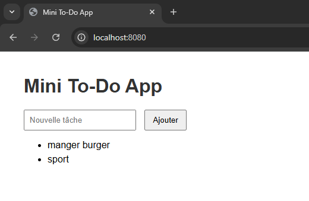

## affichage du projet en local

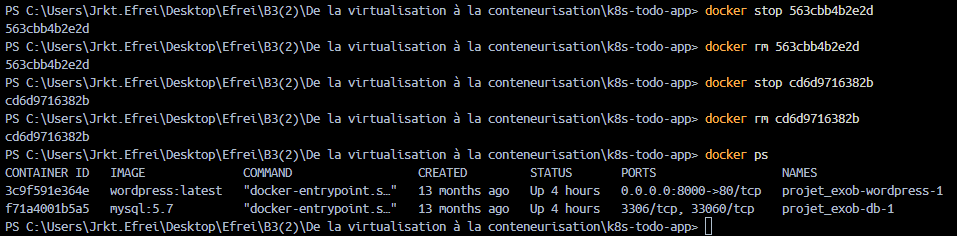

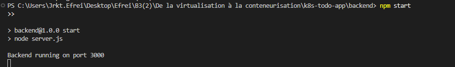

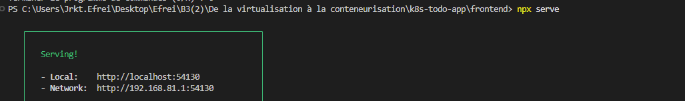

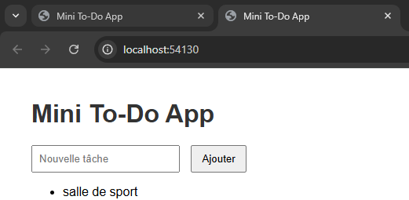

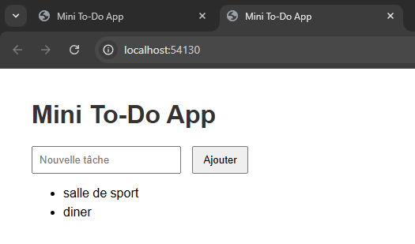

